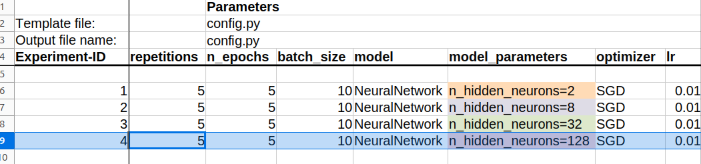
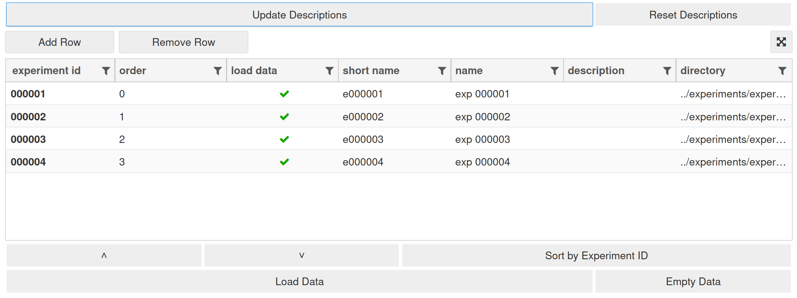
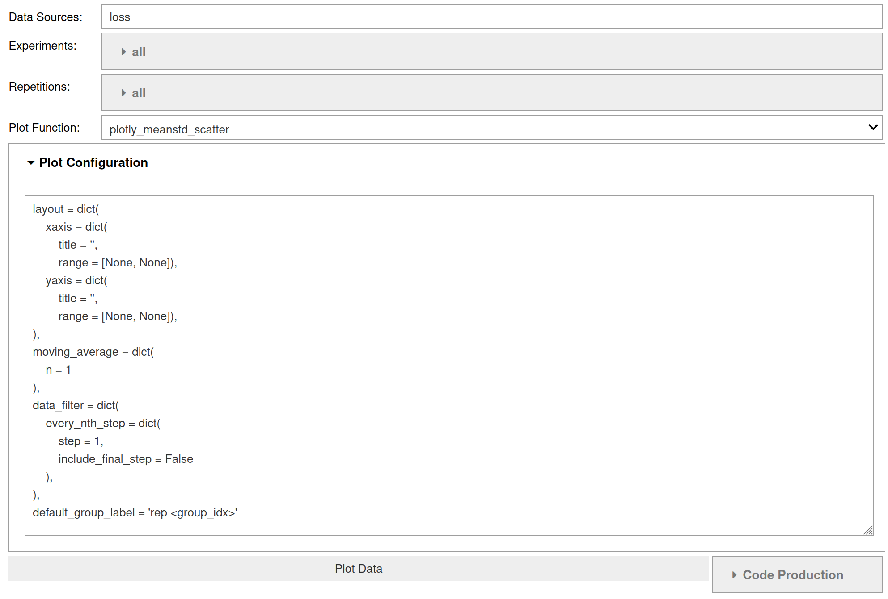
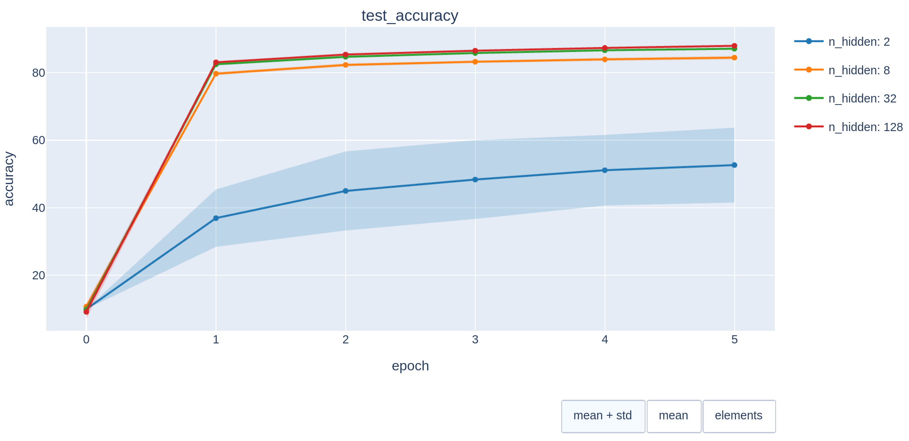
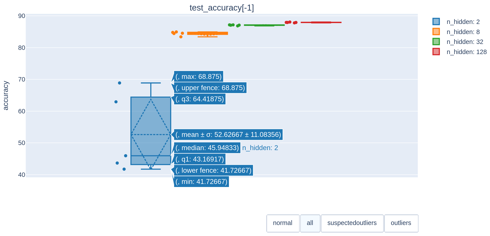
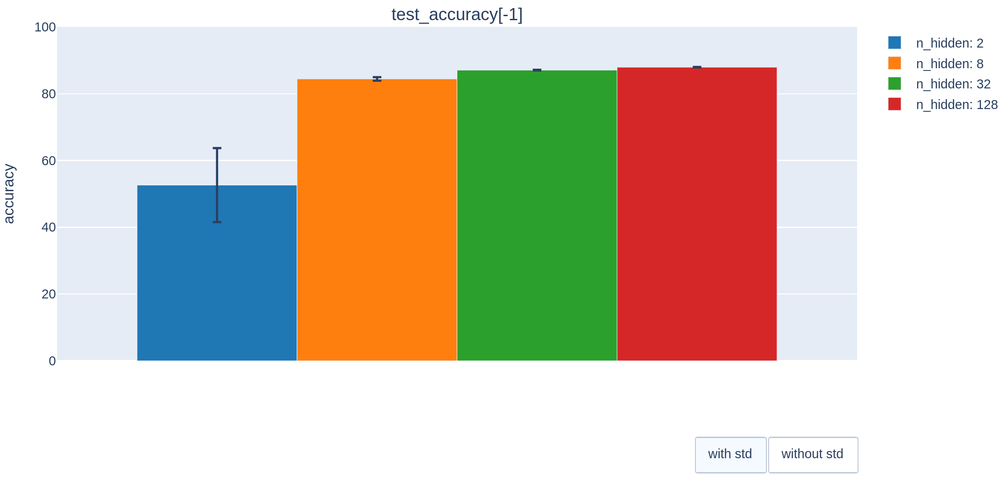
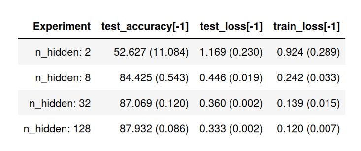
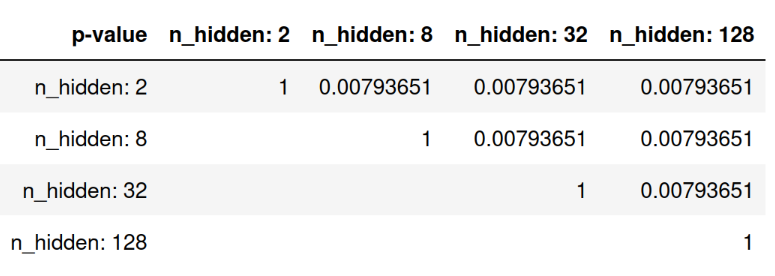

# Tutorial

## Introduction

This tutorial introduces the basic functionality of the exputils:
 
 - configuring your experiments
 - logging of data
 - running and managing experiments
 - analysis of experimental data

The tutorial uses the [_pytorch_mnist_ demo](https://github.com/ChrisReinke/exputils/tree/master/examples/pytorch_mnist) to introduce these concepts.
It explains how to use the demo and how it works.
The demo itself is based on the [PyTorch tutorial](https://pytorch.org/tutorials/beginner/basics/quickstart_tutorial.html) that introduces how to train a DNN on the example of classification.
If you are new to PyTorch, please follow first the PyTorch tutorial to understand the training procedure.
This tutorial will concentrate on the exputils functionality. 


## Setup 

Download the exputils source code from github and navigate to the _pytorch_mnist_ demo.

    git clone https://github.com/ChrisReinke/exputils.git .
    cd ./exputils/examples/pytorch_mnist

Create a conda environment (you can also use a venv) and activate it:

    conda create -n exputils_demo python=3.11
    conda activate exputils_demo

Install the latest exputils library from PyPI:

    pip install experiment-utilities

For using the exputils GUIs to load and plot data in Jupyter Notebook, the *qgrid* widget must be activated.

    jupyter contrib nbextension install --user
    jupyter nbextension enable --py --sys-prefix widgetsnbextension
    jupyter nbextension enable --py --sys-prefix qgrid

It is recommended to use the [Jupyter Notebooks Extensions](https://github.com/ipython-contrib/jupyter_contrib_nbextensions) to allow folding of code and headlines.
This makes the notebooks more readable.
Activate the extensions with:

    jupyter nbextension enable codefolding/main
    jupyter nbextension enable collapsible_headings/main

With this we have finished the installation of the exputils package.

Now, we have to install your custom python library which contains the code that is used in experiments.
In the case of the demo, this is the `my_dl_lib` which is located under `./src`.
Here we install it in developer mode (`-e`) so that changes to the code are used when the package is imported by other python code.

    pip install -e. ./src/my_dl_lib

Installing the libray will also install missing packages such as PyTorch and torchvision. 

This concludes setting up the exputils and the demo.
We are now ready to use it.


##  Project Structure

The exputils are in their functionality very versatile and allow you to freely structure your code and experiments
how you want. 
Nonetheless, we recommend to follow a certain project and folder structure for which the default parameters of the exputils functions are configured.

A project consists of two main elements: code (under the `./src` folder) and experiments.
Of course other elements such as the datasets in our example are possible.
The project has the following folder structure (entries starting with a `*` can have custom names) where each element will be explained in the following sections in more detail:  
```bash
    pytorch_mnist   
    ├── src  # code
    │   └── * my_dl_lib  # python package with code for this demo
    ├── experiments  # holds all experimental campaigns
    │   └── * my_campaign 
    └── * datasets  # optional datasets
```

## Code

First we have to create our code for which we want to run experiments.
The code will be in form of python packages, which we import when running our experiments.
If you are unfamiliar with python packages, please have a look at this [tutorial](https://realpython.com/python-modules-packages/).

The _pytorch_mnist_ demo is doing classification experiments using its `my_dl_lib` package under the `src` folder.
The main functionality under `./src/my_dl_lib/my_dl_lib`  is in the `core.py` which defines how to train and test a neural network models. 
The model itself is defined in the `models/neural_network.py`.

In the following we will first learn how to configure our experiments before going into how to log data.


### Configuration

How you configure your experiments is principle independent of the exputils.
However, the package provides functions create configurations in form of a nested dictionaries.
Each important function and class of the code takes such a dictionary as input parameter and define its default configuration in form of it.

#### AttrDict Dictionary

A special dictionary is provided that makes the configuration easier, the [`AttrDict`](reference/overview.md#exputils.misc.attrdict.AttrDict).
It allows to access its properties similar to properties `dict.value`, thus making it unnecessary to use the `dict['value']` expression.

```python
import exputils as eu
config = eu.AttrDict()
config.learn_rate = 0.01  # set a value
print(config.learn_rate)  # read a value 
```

#### Default Configuration

The main function of our code is `run_training(config=None, **kwargs)` in `core.py`.
The function loads the dataset, creates the network model, loss function, optimizer and runs the training.
It takes as input a `config` dictionary that contains the configuration of our experiment such as the number of epochs we want to run it.

First, the function defines the default configuration. 
```python
default_config = eu.AttrDict(
    seed=None,
    n_epochs=5,
    batch_size=10,
    dataset=eu.AttrDict(
        cls=datasets.FashionMNIST,
        root='./mnist',
    ),
    model=eu.AttrDict(
        cls=NeuralNetwork
    ),
    loss=eu.AttrDict(
        cls=torch.nn.CrossEntropyLoss
    ),
    optimizer=eu.AttrDict(
        cls=torch.optim.SGD,
        lr=0.01
    )
)
```

The default configuration is then compared with the given configuration to create the `config`:
```python
config = eu.combine_dicts(kwargs, config, default_config)
```
The [`combine_dicts`](reference/overview.md#exputils.misc.attrdict.combine_dicts) function combines its given dictionaries by comparing their elements also taking into account nested dictionaries. 
The first given dictionary has priority and overrides the same element of the second dictionary.

<div class="grid cards" markdown>
- __Example__:   

    ```python
    dict_a = eu.AttrDict()
    dict_a.name = 'a'
    dict_a.x_val = '1'
    
    dict_b = eu.AttrDict
    dict_b.name = 'default'
    dict_b.x_val = 0
    dict_b.y_val = 0
    
    comb_dict = eu.combine_dicts(dict_a, dict_b)
    
    print(comb_dict)
    ```

    Output:
    ```
    AttrDict({'name': 'a', 'x_val': 1, 'y_val': 0})
    ```
</div>

#### Using the Config

We are then using the dictionary to seed the random number generators (random, numpy.random, torch.random) through the [`seed`](reference/overview.md#exputils.misc.misc.seed) function that takes as input the config dictionary and uses its `seed` property to set them. If `seed=None` then a random initialization is done. 
```python
eu.misc.seed(config)
``` 

Then we use the config to load the training dataset using the [create_object_from_config](reference/overview.md#exputils.misc.misc.create_object_from_config) function:
```python
training_data = eu.create_object_from_config(
    config.dataset,
    train=True,
    transform=ToTensor(),
)
```
The function takes as input a dictionary that defines an object that should be created. 
In our case, this is a `torch.utils.data.Dataset` object. 
The given dictionary defines the class (`cls` property) used to create the object and extra parameters that are given to the `__init__` method.
The default config defines this object of class `FashionMNIST` and having as `root` parameter (location of the dataset on disk) the `./mnist` folder.
```python
config.dataset=eu.AttrDict(
    cls=datasets.FashionMNIST,
    root='./mnist',
),
```
Our call of the `create_object_from_config` function will also set the `train=True` and `transform=ToTensor()` properties which are not defined in the config. 

We use the same method to create the test_dataset, model, loss_fn and the optimizer objects for our training procedure.

#### Configuration of Classes

We can configure objects from our custom classes in a similar way.
See the `models/neural_network.py` for an example:
```python
import exputils as eu
from torch import nn

class NeuralNetwork(nn.Module):
    
    @staticmethod
    def default_config():
        return eu.AttrDict(
            n_hidden_neurons=512
        )

    def __init__(self, config=None, **kwargs):
        super().__init__()
        self.config = eu.combine_dicts(kwargs, config, self.default_config())
```
We define for each class a static method `default_config` that returns the default configuration of the class.
In the `__init__(self, config=None, **kwargs)` we take as input a config dictionary and combine it with the default configuration to have our `self.config`.

<div class="grid cards" markdown>
- __Note__: 
    The use of the `**kwargs` parameter is to allow the setting of the  configuration without the need for a dictionary.
    The following two expressions are equal:

        NeuralNetwork(config=dict(n_hidden_neurons=8))  

    and 
    
        NeuralNetwork(n_hidden_neurons=8) 
</div>


### Logging

The exputils provides several logging functions to log for example the loss of the training over its iterations or the accuracy of the model after each epoch.
Please see the [Logging section](reference/logging.md#writting) in the references for more details of its various functions .

#### Logging of Loss and Accuracy 

To start logging we import the `exputils.data.logging` module (here as `log`) in the `core.py` and then use its `add_value` function.
We can see it used in the `train` and `test` functions.

```python
import exputils.data.logging as log

...

def test(...):
    ...
    log.add_value('test/accuracy', 100 * correct)
    log.add_value('test/loss', test_loss)
```
We will see [further below](#analysis) how we can visualize our logged data.

#### Experiment Status 

Sometimes, we want to report the progress or status of our training for the user to see. 
As we might run several experiments and repetitions in parallel the `print` function is not optimal as the parallel processes all write in the same console output making it difficult to now which output is for which experiment.
To report the experiment status the exputils provides the [`update_status`](reference/overview.md#exputils.misc.misc.update_status) function.

```python
def run_training(config=None, ...):
    ...
    for t in range(config.n_epochs):
        eu.update_status(f"train epoch {t+1}")
        ...
```

The `update_status` function takes as input a string, here the current epoch number, and will write it in a status file. 
We will see [further below](#execution) how to visualize this information.

## Experiments

After having prepared the code we can set up our experiments, run them and analyze afterward their results.
Experiments are organized in form of campaigns under the `./experiments` folder.
A campaign usually compares how different algorithms and parameters perform for a specific problem such as our FashionMNIST categorization task. 
For this purpose, the demo has the `./experiments/my_campaign` where we want to compare the performance of our `NeuralNetwork` with different numbers of `n_hidden_neurons`.

Each campaign has a recommended folder structure:
```bash
my_campaign 
├── analyze  
│   └── overview.ipynb
├── src
│   └── rep
│       ├── config.py
│       └── run_repetition.py
├── experiment_configurations.ods
├── generate_experiments.sh
├── run_experiments.sh
├── get_status.sh   
└── experiments # THIS FOLDER WILL BE AUTOGENERATED!
    ├── experiment_000001
    │   ├── repeition_000001
    │   │   ├── data
    │   │   ├── config.py
    │   │   ├── run_repetition.py
    │   │   └── run_repetition.py.status
    │   ├── repeition_000002
    │   └─ ...
    ├── experiment_000002    
    └─ ...
```
The individual elements will be explained in the following sections.

### Definition

To define what code to run and which algorithms and parameters to compare in a campaign, we have to set up two elements:

 - `src` folder: This folder contains the code that should be executed during an experiment and its repetitions.
 - `experiment_configurations.ods` file: This spreadsheet file for [Libreoffice](https://www.libreoffice.org/) (open-source alternative to MS Excel) defines the algorithms and parameters of each experiments under our campaign.

The `src` folder contains a `src/rep` folder that contains the code that will be generated for each repetition of each experiment that we define in a moment in the `experiment_configurations.ods` file.

__Code of Repetitions: run_repetition.py__

The python script that we execute when we run a repetition of an experiment is the `src/rep/run_repetition.py`:
```python
#!/usr/bin/env python

# this allows to run processes in parallel on different cores without slowing down the processing
# because each of them wants to use all cores
import torch
torch.set_num_threads(1)

# read the config for this repetition from the config.py file
from config import config

# run the traning with the associated configuration for this repetition
import my_dl_lib
my_dl_lib.run_training(config=config)
```
To be able to run it directly as a script it needs the shebang: `#!/usr/bin/env python`!

It first imports pytorch to set its number of parallel threads to 1. 
This is necessary to because we will run several repetitions and experiments in parallel on the different CPU or GPU cores that we have.
But by default, some pytorch components make use of multithreading and allocate several cores automatically.
Unfortunately, if we run processes in parallel and pytorch tries to use for each of them all cores, it comes to conflicts between the cores resulting in a much longer runtime.
To avoid this, we define that each repetition can only use 1 thread and core.
By handling the parallelization of processes this way we are still faster than letting pytorch handling it.

Afterward, it imports the configuration for our experiment and repetition which we will discuss shortly.

Finally, it imports our `my_dl_lib` that we prepared and executes the `run_training` function giving it the configuration of the repetition.

__Configuration Template: config.py__

The template for the configuration is defined in the `src/rep/config.py`:
```python
import exputils as eu
import my_dl_lib
import torch
from torchvision import datasets
from torch import nn

# config for the my_dl_lib.run_training function
config = eu.AttrDict(
    # the seed if each repetition is different to have different network parameter initializations
    seed = <repetition_id>,

    # number of epochs with default of 5
    n_epochs = <n_epochs,10>,

    # batch size with default of 10
    batch_size = <batch_size,10>,

    # the loss and dataset is the same for all experiments in this campaign
    dataset = eu.AttrDict(
        cls = datasets.FashionMNIST,
        root = '../../../../../datasets/mnist'
    ),
    loss = eu.AttrDict(
        cls = nn.CrossEntropyLoss
    ),

    # as models can have different parameters, we allow to set them generally through the
    # <model_parameters> placeholder, which can have a list of them, for example: "n_layers=3, n_neurons=128"
    model = eu.AttrDict(
        cls = my_dl_lib.models.<model>,
        <model_parameters>
    ),

    optimizer = eu.AttrDict(
        cls = torch.optim.<optimizer>,
        lr = <lr>,
    ),
)
```

The configuration template file defines the [config dictionary](#configuration) that we will give our `run_traning` function as input. 
The configuration file contains incorrect python code because it contains placeholders: `<name, std_value>`. 
These place holders will be later replaced by the actual parameter values for our experiment that we define in the `experiment_configurations.ods` file.
For example, `n_epochs = <n_epochs,10>` will be later replaced by `n_epochs = 5` if the `experiment_configurations.ods` defines for `n_epochs` a value of 5.
The optional `std_value` in the place holders will be used if no value would be defined in the `experiment_configurations.ods`. 

The random `seed` will be set by the `repetition_id` which is an `int` that defines the ID of a repetition from 0 onwards.   

__Configuration: experiment_configurations.ods__

The `experiment_configurations.ods` contains the values for all the placeholders of each experiment that we want to execute.
To view and edit it, please install [LibreOffice](https://www.libreoffice.org/).

<figure markdown="span">
  
</figure>

Each line that has an `Experiment-ID` is an experiment.
ID's can be integer from 0 onwards. 
They can be freely defined, but have to be unique per campaign.

The `repetitions` column define how many repetitions should be executed for this experiment, here 5 for each.

The other columns define the values for the placeholders in our `config.py` template file.
Values can be in any format and even python code.
The exputils simply takes them as string values and replaces the corresponding placeholder with it.

You can also use colors or font modifiers to help readability. 
We can see that we want to have three experiments that differ in the `n_hidden_neurons` parameter (2, 8, 32).

With this we have defined our experiments and can execute them.

### Execution

Functions for the execution of experiments are under the `exputils.manage` module as detailed in the  [Manage](reference/manage.md) section of the Reference.
To manage experiments directly from the command line, three bash commands are provided that call the exputils functions:
    
* `generate_experiments.sh`: Generate code of experiments and repetitions.
* `run_experiments.sh`: Find which experiments and repetitions need to run and execute them in parallel.
* `get_status.sh`: Print the execution status of experiments.  

We will detail the use of these commands in the following sections. 
For more information you can call them with the `-h` param, for example `./get_status.sh -h`.

<div class="grid cards" markdown>
- __Tip__: The commands have to be copied to each campaign folder that you create. 
To avoid this, you can create them as system-wide commands. 
See this tutorial for help: [How to create custom commands](https://learnubuntu.com/create-custom-commands/#how-to-create-custom-commands-using-scripts).
</div>


#### Generation of Experiments

Before execution, we have to generate the code for each experiment and repetition.
This creates for each experiment and repetition a folder that contains the code we defined in the `./src/rep` folder. 
Moreover, it replaces the placeholders in the `config.py` with the values for the experiment and repetition.

To generate the code, call:

    ./generate_experiments.sh

Output:
    
    Generate experiments ...
    Finished.

The command creates a new folder in der campaign: `./experiments`, that contains all defined experiments and repetitions.
When opening the configuration for experiment-ID 1 and its repetition-ID 0 we can see that the placeholders were correctly adjusted according to our `experiment_configurations.ods`.

Content of file `./experiments/experiment_000001/repetition_000000/config.py`:
```python

import ...

config = eu.AttrDict(
    seed = 0,
    n_epochs = 5,
    batch_size = 10,
    dataset = eu.AttrDict(
        cls = datasets.FashionMNIST,
        root = '../../../../../datasets/mnist'
    ),
    loss = eu.AttrDict(
        cls = nn.CrossEntropyLoss
    ),
    model = eu.AttrDict(
        cls = my_dl_lib.models.NeuralNetwork,
        n_hidden_neurons=2
    ),
    optimizer = eu.AttrDict(
        cls = torch.optim.SGD,
        lr = 0.01,
    ),
)
```
The `seed` is set to the repetition-ID 0 and the `n_hidden_neurons` is correctly set to 2.

#### Running a single Repetition

To test if our experiment runs correctly we can execute a particular repetition:

    cd ./experiments/experiment_000001/repetition_000000
    ./run_repetition.py
    cd ../../..

Output:

    Using cpu device
    Test Error: 
     Accuracy: 10.0%, Avg loss: 2.359976 

    Epoch 1
    -------------------------------
    loss: 2.377968  [   10/60000]
    loss: 2.175646  [ 1010/60000]

    ...

    loss: 1.392127  [58010/60000]
    loss: 1.375843  [59010/60000]
    Test Error: 
     Accuracy: 45.9%, Avg loss: 1.343065 

    Done!

The repetition works as intended. 
You can also see that it created a `data` folder in the repetition folder that contains a numpy array file (`.npy`) for each of the variables that we logged.

    ls ./experiments/experiment_000001/repetition_000000/data

Output: 

    test_accuracy.npy  test_loss.npy  train_loss.npy

We will later visualize this data.

#### Running of Experiments

Of course, we do not want to start each repetition manually. 
Moreover, we want to run several of them in parallel on different CPU or GPU cores to save time.
To achieve this we use the `run_experiments.sh` command and instruct it to run 10 experiments / repetitions in parallel:

    ./run_experiments.sh -n 10

Output:

    Start experiments ...
    2024/11/13 09:39:08 start './experiments/experiment_000001/repetition_000001/run_repetition.py' (previous status: todo) ...
    2024/11/13 09:39:08 start './experiments/experiment_000001/repetition_000002/run_repetition.py' (previous status: todo) ...
    2024/11/13 09:39:08 start './experiments/experiment_000001/repetition_000003/run_repetition.py' (previous status: todo) ...
    2024/11/13 09:39:08 start './experiments/experiment_000001/repetition_000004/run_repetition.py' (previous status: todo) ...
    2024/11/13 09:39:08 start './experiments/experiment_000002/repetition_000000/run_repetition.py' (previous status: todo) ...
    2024/11/13 09:39:08 start './experiments/experiment_000002/repetition_000001/run_repetition.py' (previous status: todo) ...
    2024/11/13 09:39:08 start './experiments/experiment_000002/repetition_000002/run_repetition.py' (previous status: todo) ...
    2024/11/13 09:39:08 start './experiments/experiment_000002/repetition_000003/run_repetition.py' (previous status: todo) ...
    2024/11/13 09:39:08 start './experiments/experiment_000002/repetition_000004/run_repetition.py' (previous status: todo) ...
    2024/11/13 09:39:08 start './experiments/experiment_000003/repetition_000000/run_repetition.py' (previous status: todo) ...

    Using cpu device
    Using cpu device

    ...

    Done!
    2024/11/13 09:41:06 finished './experiments/experiment_000003/repetition_000003/run_repetition.py' (status: finished)
    2024/11/13 09:41:06 finished './experiments/experiment_000003/repetition_000004/run_repetition.py' (status: finished)
    Finished.

Note: If the experiments have not been generated so far then the `run_experiments.sh` command will generate them.

The command collects the first 10 repetitions that have not been started so far and executes them in parallel. 
If the first of the 10 repetitions is finished then the exputils selects the next repetition that has to be executed and starts it until all repetitions have been successfully executed.

#### Visualizing the Progress

We can see that the repetitions print outputs are also displayed in parallel making it hard to read them and see the progress.
For this purpose exists the `get_status.sh` command.
While the experiments are running, open another terminal and navigate to the campaign folder.
Then call:

    ./get_status.sh

Output:

    2024/11/13 09:53:37 ./experiments/experiment_000001/repetition_000000/run_repetition.py.status - running  train epoch 5
    2024/11/13 09:53:44 ./experiments/experiment_000001/repetition_000001/run_repetition.py.status - finished 
    2024/11/13 09:53:36 ./experiments/experiment_000001/repetition_000002/run_repetition.py.status - running  train epoch 5
    2024/11/13 09:53:34 ./experiments/experiment_000001/repetition_000003/run_repetition.py.status - running  train epoch 5
    2024/11/13 09:53:35 ./experiments/experiment_000001/repetition_000004/run_repetition.py.status - running  train epoch 5
    2024/11/13 09:53:32 ./experiments/experiment_000002/repetition_000000/run_repetition.py.status - running  train epoch 5
    2024/11/13 09:53:34 ./experiments/experiment_000002/repetition_000001/run_repetition.py.status - running  train epoch 5
    2024/11/13 09:53:46 ./experiments/experiment_000002/repetition_000002/run_repetition.py.status - finished 
    2024/11/13 09:53:35 ./experiments/experiment_000002/repetition_000003/run_repetition.py.status - running  train epoch 5
    2024/11/13 09:53:38 ./experiments/experiment_000002/repetition_000004/run_repetition.py.status - running  train epoch 5
    2024/11/13 09:53:44 ./experiments/experiment_000003/repetition_000000/run_repetition.py.status - running 
    2024/11/13 09:53:47 ./experiments/experiment_000003/repetition_000001/run_repetition.py.status - running 
    2024/11/13 09:52:35 ./experiments/experiment_000003/repetition_000002/run_repetition.py.status - todo 
    2024/11/13 09:52:35 ./experiments/experiment_000003/repetition_000003/run_repetition.py.status - todo 
    2024/11/13 09:52:35 ./experiments/experiment_000003/repetition_000004/run_repetition.py.status - todo 
    total: 15 | todo: 3 | running: 10 | error: 0 | finished: 2 

We can see that 2 repetitions are finished, 10 are running and 3 are still to be started. 
The command also shows us the current training epoch of each repetition that we are reporting using the [`update_status`](reference/overview.md#exputils.misc.misc.update_status) function in our code.

<div class="grid cards" markdown>
- __Tip__: To get a contiuous update of the status use the `-t` flag of the `get_status.sh` command. You can exit it with `Ctrl+C`.
 To avoid that it displayes information about already finished experiments use the `-u` flag.
        
        ./get_status.sh -t -u
</div>


#### Running Additional Experiments

Usually our initial experiments are not enough and we have to run further parameters.
This can be easily done by adding new lines in the `experiment_configurations.ods` file and then by running again the experiments.

Let's add a new experiments (ID: 4) that evaluates our network model with 128 `n_hidden_neurons` to the `experiment_configurations.ods`:

<figure markdown="span">
  
</figure>

After saving the file, we use again our command to run experiments. Besides running experiments, it will also generate them first:

    ./run_experiments.sh -n 10

Output:

    Start experiments ...
    2024/11/13 13:12:53 start './experiments/experiment_000004/repetition_000000/run_repetition.py' (previous status: todo) ...
    2024/11/13 13:12:53 start './experiments/experiment_000004/repetition_000001/run_repetition.py' (previous status: todo) ...
    2024/11/13 13:12:53 start './experiments/experiment_000004/repetition_000002/run_repetition.py' (previous status: todo) ...
    2024/11/13 13:12:53 start './experiments/experiment_000004/repetition_000003/run_repetition.py' (previous status: todo) ...
    2024/11/13 13:12:53 start './experiments/experiment_000004/repetition_000004/run_repetition.py' (previous status: todo) ...
    
    ...

    Finished.

We can observe that the command only starts the repetitions of the new experiment (ID: 4).
It will not rerun experiments that have been already executed.

__Note__: If you want to rerun experiments, you have to delete their folders under `./experiments`.
Exputils will then regenerate and rerun them. 


### Analysis

After our experiments have been finished we want to look at their results. 
The exputils provide some useful Jupyter widgets to load our logged data and visualize them with interactive plots.
For this you have to install some extras for Jupyter notebook as outlined in the [Installation](install.md#2-jupiter-notebook) section.

Inside our campaign start Jupyter notebook:

    jupyter notebook

Inside the notebook, open the prepared notebook `./analyze/overview.ipynb`.

#### Loading Data

The first cell imports the exputils and opens the [ExperimentDataLoaderWidget](reference/visualization.md#exputils.gui.jupyter.experiment_data_loader_widget.ExperimentDataLoaderWidget).

    import exputils as eu
    experiment_data_loader = eu.gui.jupyter.ExperimentDataLoaderWidget()
    display(experiment_data_loader)

<figure markdown="span">
  
</figure>

We can see all the experiments that we executed and that we can load.
Click the '_Load Data_' button to load the data from the checkmarked (<span style="color:green">:octicons-check-16:</span>) items.

Output:

    Load data ...
    Data successfully loaded.

The widget loaded all the logged data that was in the `data` folder of each repetition.
If you run new experiments at a later point, click on _Update Descriptions_ to see them in the table and load them.


The data is stored in the nested dictionary `experiment_data_loader.experiment_data` that has the following general structure:

```bash
experiment_data_loader.experiment_data: dict
└── key: <Experiment-ID> (str): dict  
    └── key: 'repetition_data': dict
        └── key: <Repetition-ID> (int): dict    
            └── key: <datasource_name> (int): data usually as numpy array
```

The next cell prints the data in a 'pretty' way:

    def pretty(d, indent=0):
       for key, value in d.items():
          print('\t' * indent + str(key))
          if isinstance(value, dict):
             pretty(value, indent+1)
          else:
             print('\t' * (indent+1) + str(value))
    
    pretty(experiment_data_loader.experiment_data)

Output (shortened):
    
    000001
        repetition_data
            0
                test_loss
                    [2.35997581 1.73878336 1.5804979  1.46617584 1.37025173 1.34306539]
                train_loss
                    [2.37796783 2.38081217 2.57028079 ... 1.57344127 1.52922952 1.03360915]
                test_accuracy
                    [10.         33.215      32.38333333 44.97166667 46.80833333 45.94833333]
            1
            ...
    000002
    ...


#### Visualizing Data

With the data loaded, we can now visualize it.
The [ExperimentDataPlotSelectionWidget](reference/visualization.md#exputils.gui.jupyter.experiment_data_plot_selection_widget.ExperimentDataPlotSelectionWidget)
allows to select which datasources (variables that we logged) to plot and by which plotting tool.
The next cell calls it:

    experiment_data_plotter = eu.gui.jupyter.ExperimentDataPlotSelectionWidget(experiment_data_loader)
    display(experiment_data_plotter)

<figure markdown="span">
  
</figure>

In the _Data Sources_ field we input the name of the datasource we want to plot.
Under _Plot Function_ we can select the plotting tool which can be configured in the _Plot Configuration_ section.

#### Line Plots

First, we would like to plot the `test_accuracy` data in a line plot.
For this we enter `test_accuracy` in the the _Data Sources_ field, select  
[plotly_meanstd_scatter](reference/visualization.md#exputils.gui.jupyter.plotly_meanstd_scatter.plotly_meanstd_scatter) 
as _Plot Function_ and press the _Plot Data_ button.

<figure markdown="span">
  
</figure>

The interactive plot shows us the accuracy over training epochs.
Each line represents the mean accuracy per experiment and the shaded area the standard deviation.
All plots are based on [plotly](https://plotly.com/python/), so they are interactive.
You can zoom in the plot or select which data curve should be only visible by clicking on the labels.
The buttons on the bottom also allow to view for example the individual elements (repetitions) or each experiment. 

#### Changing the Plot Configuration

We can modify the configuration of the plot to make things more clear. 
Replace the _Plot Configuration_ with the following config to modify the labels of the x-axis and y-axis:

```python
layout = dict(
    xaxis = dict(title = 'epoch'), 
    yaxis = dict(title = 'accuracy'),
)
```

Moreover, we want to change the labels of the experiments.
For, this go back to the ExperimentDataLoaderWidget (the table that shows which data to load) and change the _name_ of each experiment.
(Note: You do not need to reload the data.)

    exp 000001 --> n_hidden: 2
    exp 000002 --> n_hidden: 8
    exp 000003 --> n_hidden: 32
    exp 000004 --> n_hidden: 128


With these changes plot the data again using the _Plot Data_ button.

<figure markdown="span">
  
</figure>

#### Creating Dedicated Plots

Instead of using in the future always the ExperimentDataPlotSelectionWidget to plot the accuracy data we can also create a dedicated cell to plot the figure that we configured.
Open the _Code Production_ selection of the Plot Selection Widget and select _Multi Line_.
This creates a new cell below the current one with:

```python
# Plotting of ['test_accuracy'] 
import exputils as eu
from exputils.gui.jupyter.plotly_meanstd_scatter import plotly_meanstd_scatter

plot_config = eu.AttrDict(
layout = dict(
    xaxis = dict(title = 'epoch'), 
    yaxis = dict(title = 'accuracy'),
)
)

selection_widget = eu.gui.jupyter.ExperimentDataPlotSelectionWidget(
    experiment_data_loader,
    datasources=['test_accuracy'],
    experiment_ids='all',
    repetition_ids='all',
    output_format=('S', 'E', 'D'),
    data_filter='',
    plot_function=plotly_meanstd_scatter,
    plot_function_config=plot_config,
    state_backup_name='state_backup_153826407',
    state_backup_variable_filter=['experiment_ids', 'repetition_ids'],  # only save these variables as backup
    is_datasources_selection=False,
    is_output_format_selection=False,
    is_data_filter_selection=False,
    is_plot_function_selection=False,
    is_plot_function_config_editor=False,
    is_code_producer=False) 
display(selection_widget)
selection_widget.plot_data()
```
If you execute the cell, you can see that it replicates the plot.
The configuration for the plot can now be directly changed through this code.
We can use this method to create all the general plots that we need to analyze our campaign.

In the rest of our notebook there are already several of these plots created. 
We discuss them in the following sections.


#### Box Plots

We want to better illustrate the final accuracy of each experiment.
For this we can use a box plot that compares scalar values between experiments.

Use again the [ExperimentDataPlotSelectionWidget](reference/visualization.md#exputils.gui.jupyter.experiment_data_plot_selection_widget.ExperimentDataPlotSelectionWidget) with the following configuration:

* _Data Sources_: `test_accuracy[-1]` (This selects the final array element in our datasource.)
* _Plot Function_: [plotly_box](reference/visualization.md#exputils.gui.jupyter.plotly_box.plotly_box)
* _Plot Configuration_: `layout = dict(yaxis = dict(title = 'accuracy'))`

<figure markdown="span">
  
</figure>

The interactive plot shows you several statistics such as the mean, median, min and max of each final accuracy over the 5 repetitions per experiment.
If you select the `_all_` button at the bottom of the plot you can also see the individual outcomes of each repetition as dots next to each box.

The plot shows use clearly that the accuracy increases with a higher number of hidden neurons in the NeuralNetwork model, but that there is also a diminishing return.

#### Bar Plots

The next plot is similar, but presents each experiment as a bar. 

Use: 

* _Data Sources_: `test_accuracy[-1]`
* _Plot Function_: [plotly_meanstd_bar](reference/visualization.md#exputils.gui.jupyter.plotly_meanstd_bar.plotly_meanstd_bar)
* _Plot Configuration_: `layout = dict(yaxis = dict(title='accuracy', range=[0,100]))`

<figure markdown="span">
  
</figure>

#### Tables

We can show the information also in a table which allows us also to visualize several datasources together.

Use:

* _Data Sources_: `test_accuracy[-1], test_loss[-1], train_loss[-1]`
* _Plot Function_: [tabulate_meanstd](reference/visualization.md#exputils.gui.jupyter.tabulate_meanstd.tabulate_meanstd)
* _Plot Configuration_: ```flip_rows_and_cols = True, top_left_cell_content = 'Experiment'```

<figure markdown="span">
  {width="500"}
</figure>

The table shows for the final accuracy and each final loss the average and in brackets the standard deviation over all repetition. 


#### Pairwise-Comparison Tables

We can also compare the one scalar value of each experiment pairwise with each other experiment.
With this we can compute for example a [Mann–Whitney U test](https://en.wikipedia.org/wiki/Mann%E2%80%93Whitney_U_test) to see if the results are statistically significant different.

Use:

* _Data Sources_: `test_accuracy[-1]`
* _Plot Function_: [tabulate_pairwise](reference/visualization.md#exputils.gui.jupyter.tabulate_pairwise.tabulate_pairwise)
* _Plot Configuration_: Keep the default.

<figure markdown="span">
  {width="550"}
</figure>

The table shows the p-value for each test.
As they are all way below 0.01 we can establish that the resulting accuracy differences between our models are statistically significant. 
You can choose which function to use to compare experiments.
See more details at the reference for [tabulate_pairwise](reference/visualization.md#exputils.gui.jupyter.tabulate_pairwise.tabulate_pairwise).


